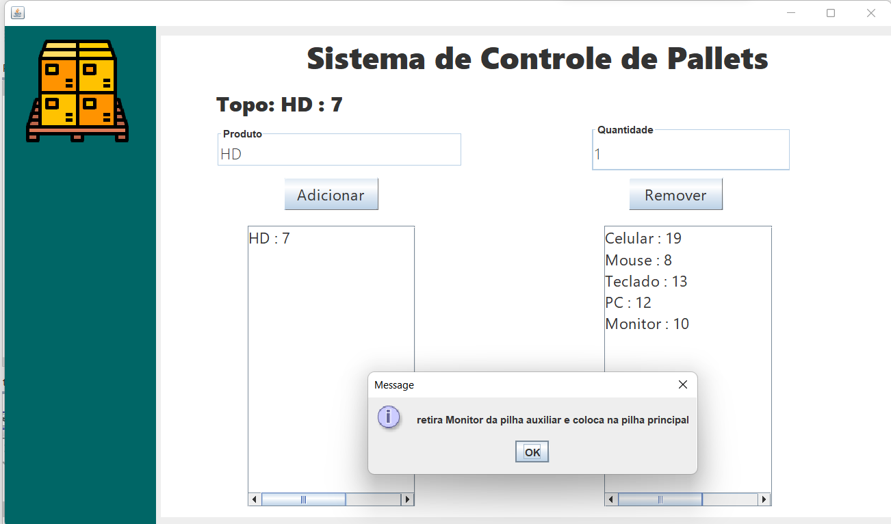

# Sistema de Controle de Pallets
### O sistema faz o controle da pilha, primeiro procura o produto que ele vai remover,   passando os intens da pilha principal para auxiliar até encontrar o que procura, faz alteração  e depois ele volta tudo que estava na pilha auxiliar para pilha principal
Linguagem|IDE|Interface
---|---|---
Java|Netbens|Swing

### Sistema funcionado

